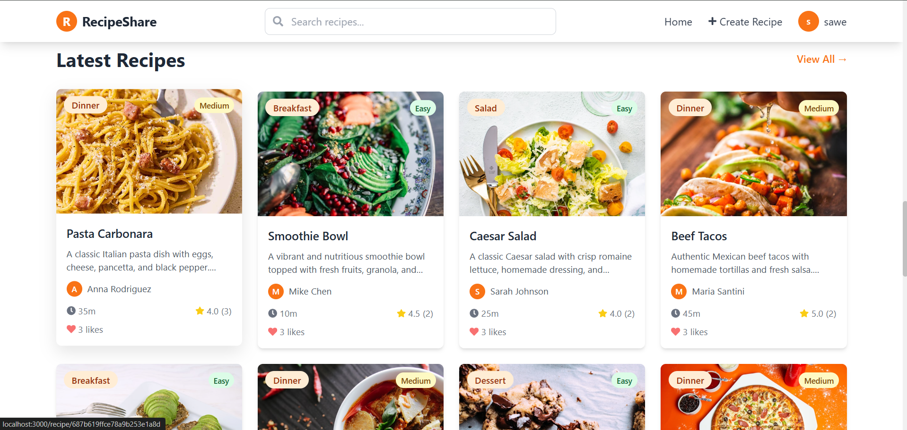
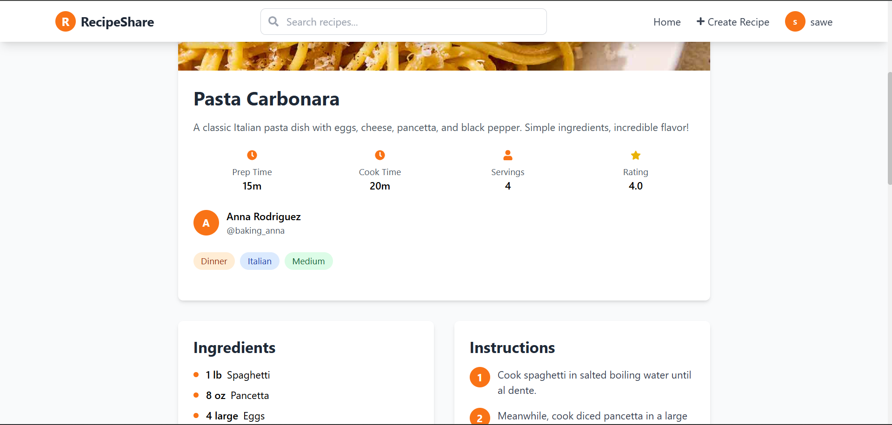
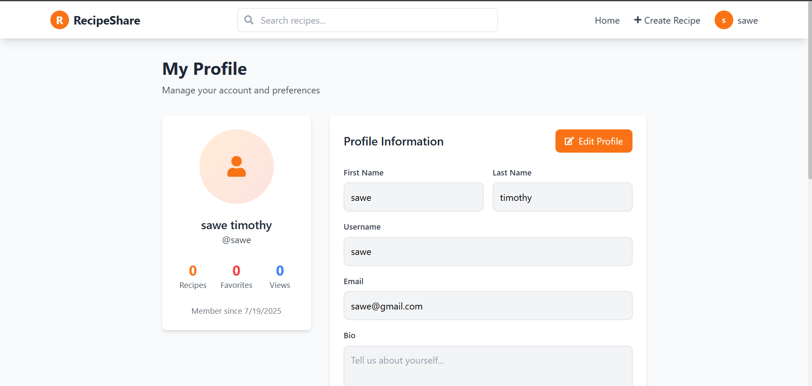
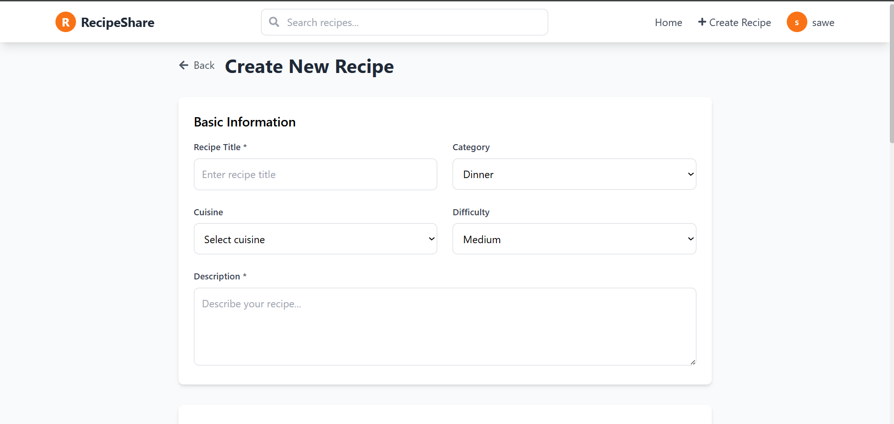

# 🍽️ RecipeShare - MERN Stack Recipe Sharing Platform

A comprehensive full-stack MERN application that allows users to share, discover, and manage recipes. Built with MongoDB, Express.js, React.js, and Node.js.

## 🚀 Live Demo

- **Frontend**: [Deployed on Vercel](https://recipe-share-app.vercel.app)
- **Backend**: [Deployed on LeapCell](https://leapcell.io/)

### 📹 Video Demo

🎥 **[Watch Interactive Demo](https://app.supademo.com/demo/cmdabc3cj0b4z10or5ss8vcny)**

Experience the full RecipeShare application with this interactive demo showcasing all features including recipe creation, search, user profiles, and more!

## ✨ Features

### 🔐 Authentication & User Management
- User registration and login with JWT authentication
- Password hashing with bcrypt
- User profiles with customizable avatars and bios
- Password change functionality

### 📝 Recipe Management
- Create, edit, and delete recipes
- Rich recipe details including ingredients, instructions, and cooking times
- Recipe categories and difficulty levels
- Image upload support for recipe photos
- Public/private recipe visibility

### 🔍 Search & Discovery
- Advanced search functionality with filters
- Browse recipes by category, cuisine, and difficulty
- Sort recipes by newest, rating, cooking time, and title
- Real-time search suggestions

### ⭐ Reviews & Ratings
- Rate recipes with 1-5 stars
- Leave detailed reviews and comments
- View average ratings and review counts
- User review history

### ❤️ Social Features
- Like and favorite recipes
- View top chefs and popular recipes
- User activity feeds

### 📱 Responsive Design
- Mobile-first responsive design
- Modern UI with Tailwind CSS
- Smooth animations and transitions
- Progressive Web App features

## 🛠️ Tech Stack

### Backend
- **Node.js** - Runtime environment
- **Express.js** - Web framework
- **MongoDB** - NoSQL database
- **Mongoose** - ODM for MongoDB
- **JWT** - Authentication
- **bcryptjs** - Password hashing
- **Socket.io** - Real-time features
- **Jest** - Testing framework

### Frontend
- **React.js** - UI library
- **React Router** - Client-side routing
- **React Query** - Data fetching and caching
- **Tailwind CSS** - Utility-first CSS framework
- **React Hook Form** - Form management
- **React Hot Toast** - Notifications
- **Framer Motion** - Animations

## 📦 Installation & Setup

### Prerequisites
- Node.js (v18 or higher)
- MongoDB (local or Atlas)
- npm or yarn

### Backend Setup

1. **Clone the repository**
   ```bash
   git clone <repository-url>
   cd week-8-capstone_-sawe-blip
   ```

2. **Install dependencies**
   ```bash
   cd server
   npm install
   ```

3. **Environment configuration**
   ```bash
   cp env.example .env
   # Edit .env with your configuration
   ```

4. **Start the server**
   ```bash
   npm run dev  # Development mode -all 
   npm start    # Production mode
   ```

### Frontend Setup

1. **Install dependencies**
   ```bash
   cd client
   npm install
   ```

2. **Start the development server**
   ```bash
   npm start
   ```

3. **Build for production**
   ```bash
   npm run build
   ```

## 🗄️ Database Schema

### User Model
```javascript
{
  username: String (unique),
  email: String (unique),
  password: String (hashed),
  firstName: String,
  lastName: String,
  avatar: String,
  bio: String,
  favoriteRecipes: [Recipe IDs],
  myRecipes: [Recipe IDs],
  isAdmin: Boolean
}
```

### Recipe Model
```javascript
{
  title: String,
  description: String,
  author: User ID,
  image: String,
  prepTime: Number,
  cookTime: Number,
  servings: Number,
  difficulty: Enum (Easy, Medium, Hard),
  cuisine: String,
  category: Enum (Breakfast, Lunch, Dinner, etc.),
  ingredients: [{
    name: String,
    amount: String,
    unit: String
  }],
  instructions: [{
    step: Number,
    description: String
  }],
  reviews: [{
    user: User ID,
    rating: Number,
    comment: String
  }],
  likes: [User IDs],
  isPublic: Boolean,
  isFeatured: Boolean
}
```

## 🧪 Testing

### Backend Tests
```bash
cd server
npm test              # Run all tests
npm run test:watch    # Run tests in watch mode
```

### Frontend Tests
```bash
cd client
npm test              # Run all tests
npm test -- --watch   # Run tests in watch mode
```

## 📡 API Endpoints

### Authentication
- `POST /api/auth/register` - Register new user
- `POST /api/auth/login` - User login
- `GET /api/auth/me` - Get current user profile
- `PUT /api/auth/profile` - Update user profile
- `POST /api/auth/change-password` - Change password

### Recipes
- `GET /api/recipes` - Get all recipes with filters
- `GET /api/recipes/featured` - Get featured recipes
- `GET /api/recipes/:id` - Get single recipe
- `POST /api/recipes` - Create new recipe
- `PUT /api/recipes/:id` - Update recipe
- `DELETE /api/recipes/:id` - Delete recipe
- `POST /api/recipes/:id/reviews` - Add review
- `POST /api/recipes/:id/like` - Toggle like
- `POST /api/recipes/:id/favorite` - Toggle favorite

### Users
- `GET /api/users/profile/:username` - Get user profile
- `GET /api/users/my-recipes` - Get user's recipes
- `GET /api/users/favorites` - Get user's favorites
- `GET /api/users/search` - Search users
- `GET /api/users/top-chefs` - Get top chefs

## 🚀 Deployment

### Backend Deployment (Render)
1. Connect your GitHub repository to Render
2. Set environment variables in Render dashboard
3. Deploy automatically on push to main branch

### Frontend Deployment (Vercel)
1. Connect your GitHub repository to Vercel
2. Set build command: `cd client && npm install && npm run build`
3. Set output directory: `client/build`
4. Deploy automatically on push to main branch

## 📱 Screenshots

### Home Page


### Recipe Detail


### User Profile


### Create Recipe


## 🤝 Contributing

1. Fork the repository
2. Create a feature branch (`git checkout -b feature/amazing-feature`)
3. Commit your changes (`git commit -m 'Add amazing feature'`)
4. Push to the branch (`git push origin feature/amazing-feature`)
5. Open a Pull Request

## 📄 License

This project is licensed under the MIT License - see the [LICENSE](LICENSE) file for details.


## 🙏 Acknowledgments

- [React Documentation](https://react.dev/)
- [Express.js Documentation](https://expressjs.com/)
- [MongoDB Documentation](https://docs.mongodb.com/)
- [Tailwind CSS](https://tailwindcss.com/)
- [React Query](https://tanstack.com/query)

---

⭐ **Star this repository if you found it helpful!** 
